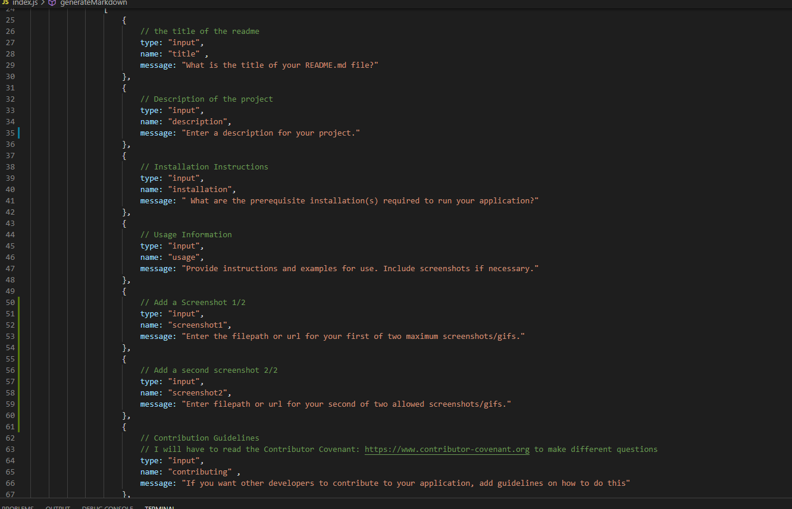

# Readme-Generator

#### Table of Contents
* [Description](##Description)
* [Installation](##Installation)
* [Usage](##Usage)
* [License](##License)
* [Contributing](##Contributing)
* [Tests](##Tests)
* [Questions](##Questions)

## Description

of this exercise is to learn the usage of Node.JS and its various modules.  Also we will learn to use Asynchronous commands as well as template literals.

## Installation

Node.js  Visual Studio Code  Web Browser

## Usage 

Open Git Bash command line within the application folder. Type: "node index.js" and then follow the prompts.
   

## License

This application is licensed under the Apache License 2.0.   To read more about the conditions of this license, visit: https://opensource.org/licenses/Apache-2.0  

## Contributing

To contribute, send me an email which is shown in the Questions Section Below.   Or visit my Github and contact me there.

## Tests

To test, just run the application.

## Questions

For questions, email me at: lamcnguyen89@gmail.com  
Or visit my Github [here](https://github.com/lamcnguyen89)

        